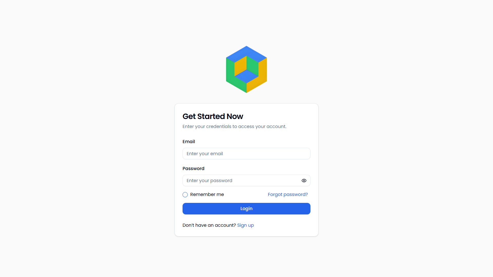
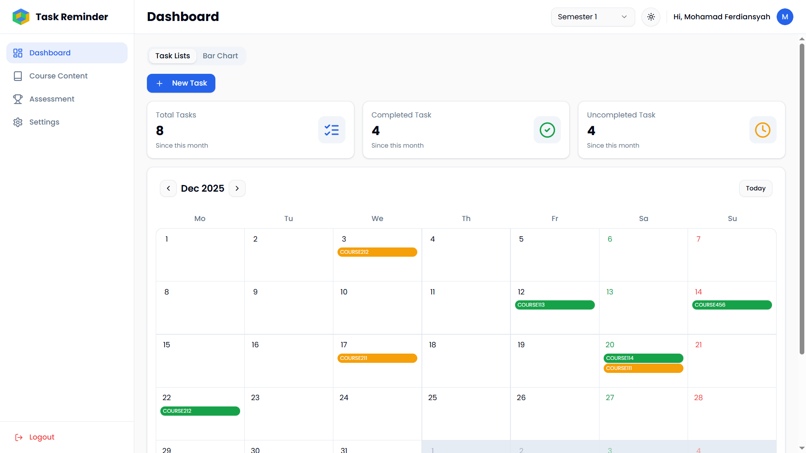
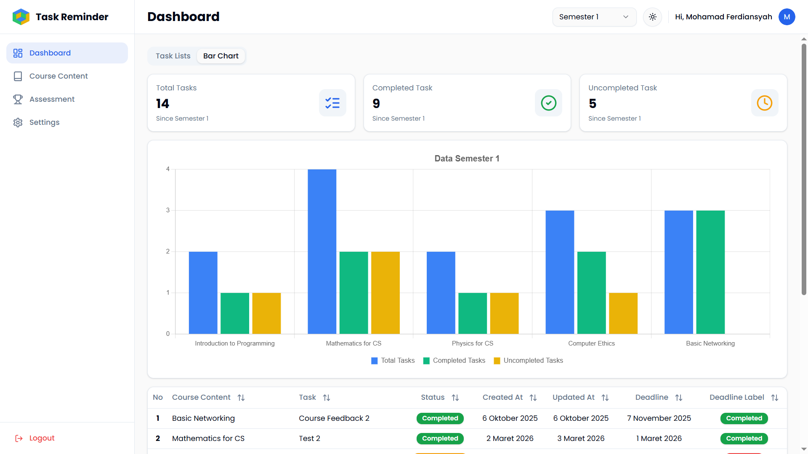
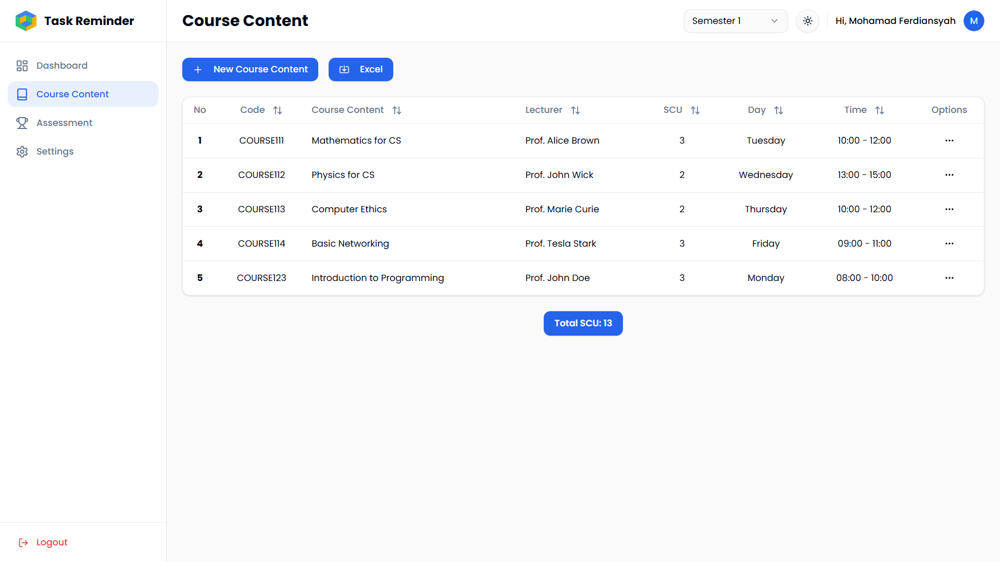
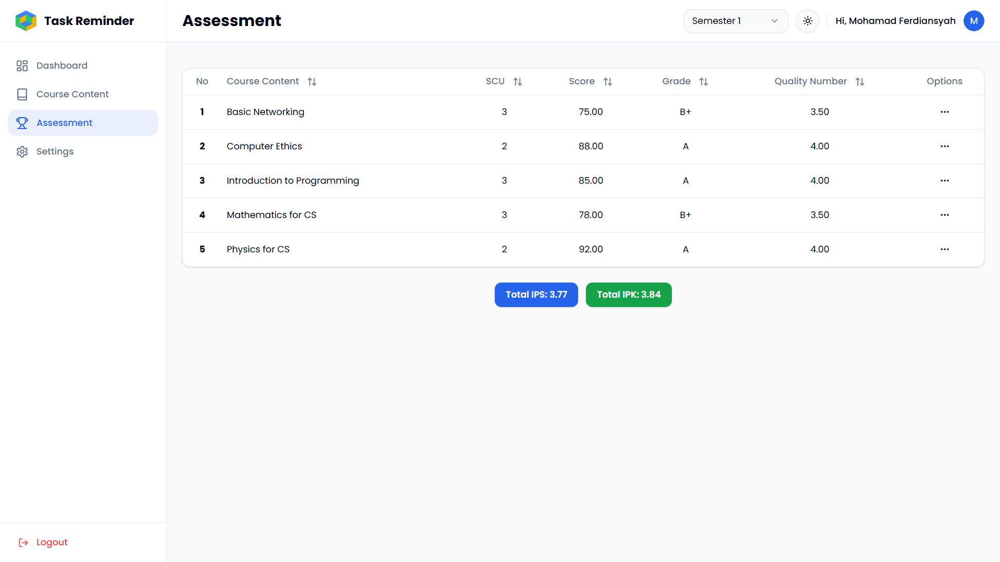
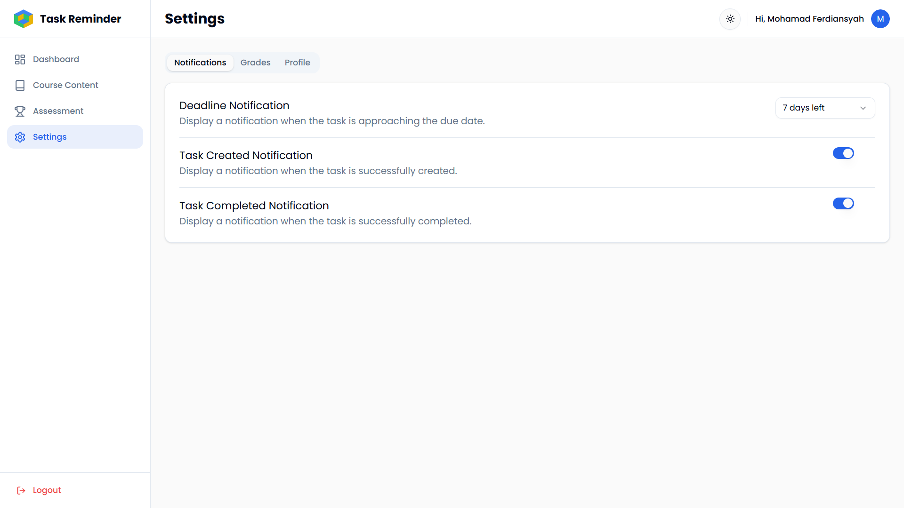
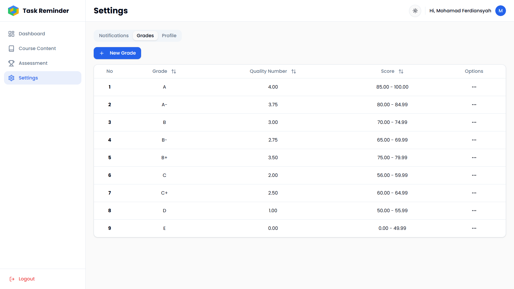

<p align="center">
  
</p>

# Task Reminder

Task Reminder is a college assignment reminder application designed to help students manage and prioritize their tasks. It includes task planning, GPA tracking, schedule management, and configurable notifications so assignments can be completed on time.

## Features

- **Task Management**: Create, update, delete, and complete tasks with due-date tracking.
- **Course Content Management**: Manage semester course data and import it from Excel.
- **Weekly Schedule Page**: Dedicated schedule page with overlap detection.
- **Task Calendar**: Monthly calendar with task status badges.
- **Dashboard Analytics**: Bar chart and semester overview for academic progress.
- **Assessment & GPA Tracking**: Record scores and calculate semester/cumulative GPA.
- **Custom Grade Scale**: Manage your own grade ranges and points.
- **Notification Channels**: Choose `email`, `telegram`, or `both` from settings.
- **Telegram Integration**: Telegram Bot API notifications with MarkdownV2 formatting.
- **Test Notification Button**: Send dummy notification before enabling live flow.
- **Email Templates**: Consistent Blade templates for account and task emails.
- **Queued Email Delivery**: Email notifications are delivered through Laravel queue.
- **User Settings**: Manage profile, password, and notification preferences.
- **Theme Support**: Light, dark, and system theme cycle.
- **Responsive Design**: Optimized for mobile, tablet, and desktop.
- **Authentication**: Secure auth flow with email verification and password reset.

## Tech Stack

### Frontend

- React 18+ with Vite
- Tailwind CSS
- shadcn/ui components (Radix UI)
- Chart.js (Bar & Line charts)
- Zustand (State management)
- date-fns (Date utilities)

### Backend

- Laravel 12+ (PHP 8.2+)
- Laravel Sanctum (API authentication)
- Laravel Octane
- Maatwebsite Excel (Excel import/export)
- Queue system for email notifications
- Telegram Bot API

## Notification Notes

- **Email** notifications (including test email) use Laravel notifications with `ShouldQueue`.
- **Telegram** notifications are sent via Bot API in `MarkdownV2` mode.
- To send Telegram messages, set `TELEGRAM_BOT_TOKEN` and save user `telegram_chat_id` in settings.

## Setup

### Prerequisites

- PHP 8.2+
- Composer
- Node.js 18+
- pnpm
- MySQL (or compatible database)

### Backend (`server/`)

```bash
cd server
composer install
npm install
cp .env.example .env
php artisan key:generate
php artisan migrate
```

### Frontend (`client/`)

```bash
cd client
pnpm install
```

### Run Development Servers

Backend API + queue + logs:

```bash
cd server
composer run dev
```

Frontend SPA:

```bash
cd client
pnpm dev
```

### Optional Commands

Run queue worker only:

```bash
cd server
php artisan queue:listen --tries=1
```

Run reminder command manually:

```bash
cd server
php artisan notifications:reminder
```

Run tests:

```bash
cd server
php artisan test
```

## Screenshots

### Login



### Dashboard



### Bar Chart



### Course Contents



### Assessments



### Settings



### Grades


