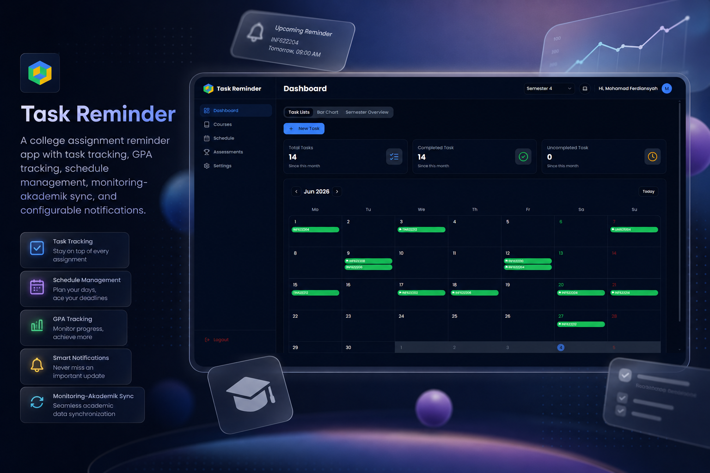

<p align="center">
  
</p>

<h1 align="center">Task Reminder</h1>

<p align="center">
  
  
  
  
  
  
</p>

<p align="center">
  A college assignment reminder app with task tracking, GPA tracking, schedule management, monitoring-akademik sync, and configurable notifications.
</p>

## Features

- **Task Management**: Create, update, delete, and complete tasks with due-date tracking and priority flags.
- **Course Content Management**: Manage semester course data and import it from Excel.
- **Weekly Schedule Page**: Dedicated schedule page with overlap detection and multi-week navigation.
- **Task Calendar**: Monthly calendar with task status badges and overdue highlighting.
- **Dashboard Analytics**: Bar chart and semester overview for academic progress.
- **Assessment & GPA Tracking**: Record scores and calculate semester/cumulative GPA.
- **Monitoring Akademik Sync**: Pull scores from an external monitoring-akademik-siakang API and match courses by name.
- **Custom Grade Scale**: Manage your own grade ranges and points.
- **Notification Channels**: Choose `email`, `telegram`, or `both` from settings.
- **Telegram Integration**: Telegram Bot API notifications with MarkdownV2 formatting.
- **Test Notification Button**: Send dummy notification before enabling live flow.
- **Email Templates**: Consistent Blade templates for account and task emails.
- **Queued Email Delivery**: Email notifications are delivered through Laravel queue.
- **User Settings**: Manage profile, password, and notification preferences.
- **Theme Support**: Light, dark, and system theme cycle.
- **Responsive Design**: Optimized for mobile, tablet, and desktop.
- **Authentication**: Secure auth flow with email verification and password reset.

## Tech Stack

### Frontend

- React 18+ with Vite (SPA)
- Tailwind CSS
- shadcn/ui components (New York style, JSX)
- Chart.js (Bar & Line charts)
- Zustand (State management)
- date-fns (Date utilities)
- Lucide (Icons)

### Backend

- Laravel 12+ (PHP 8.2+)
- Laravel Sanctum (SPA API authentication)
- Laravel Octane (FrankenPHP server)
- Maatwebsite Excel (Excel import/export)
- Database queue driver for email notifications
- Telegram Bot API
- Pest testing framework

## Setup

### Prerequisites

- PHP 8.2+
- Composer
- Node.js 18+
- pnpm
- MySQL (or compatible database)

### Backend (`server/`)

```bash
cd server
composer install
npm install
cp .env.example .env
php artisan key:generate
php artisan migrate
```

### Frontend (`client/`)

```bash
cd client
pnpm install
```

### Environment Variables

| Variable | Description |
|---|---|
| `DB_DATABASE` | MySQL database name |
| `QUEUE_CONNECTION` | Queue driver (set to `database`) |
| `FRONTEND_URL` | CORS/origin for Sanctum (default `http://localhost:5173`) |
| `TELEGRAM_BOT_TOKEN` | Required for Telegram notifications |
| `MONITORING_URL` | Base URL of monitoring-akademik API (e.g. `http://localhost:3000`) |

### Run Development Servers

Both must run concurrently:

```bash
# Terminal 1 — Backend API (:8000) + queue + logs
cd server
composer run dev

# Terminal 2 — Frontend SPA (:5173)
cd client
pnpm dev
```

### Useful Commands

```bash
# Run queue worker only
cd server && php artisan queue:listen --tries=1

# Trigger reminder notifications manually
cd server && php artisan notifications:reminder

# Run tests (Pest)
cd server && php artisan test

# Run a single test suite
cd server && php artisan test --testsuite=Feature

# Lint client
cd client && pnpm lint
```

## Architecture

- **Controller → Service**: Controllers delegate to services. All controllers use `ApiResponse` trait for JSON.
- **Sanctum SPA auth**: Most API routes require `auth:sanctum` + `verified` middleware.
- **Queue**: Database driver. Email notifications use `ShouldQueue`.
- **Notifications**: `notifications:reminder` sends both email (queued) and Telegram (synchronous) per user settings.
- **Monitoring Sync**: Reads `MONITORING_URL` from config, fetches tasks and grade data server-side.

## Monitoring Akademik Sync

The app can sync scores from [monitoring-akademik-siakang](https://github.com/mohfer/monitoring-akademik-siakang) — an external API that tracks student grades per task.

1. Set `MONITORING_URL` in `.env` (e.g. `http://localhost:3000`).
2. Go to **Assessments** page → click **Sync from Monitoring**.
3. Select a monitoring task and click **Sync**.

The sync matches courses by name (case-insensitive, supports parenthetical codes). The connection is server-to-server, so no CORS issues.

## Notification Notes

- **Email** notifications (including test email) use Laravel notifications with `ShouldQueue`.
- **Telegram** notifications are sent via Bot API in `MarkdownV2` mode.
- To send Telegram messages, set `TELEGRAM_BOT_TOKEN` and save user `telegram_chat_id` in settings.