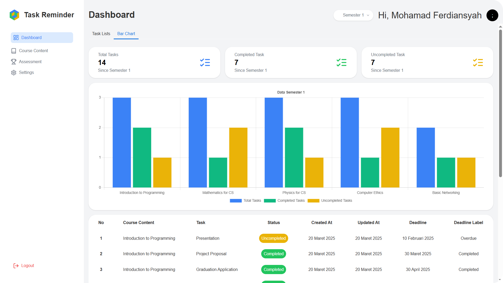

# Task Reminder

Task Reminder adalah aplikasi pengingat tugas kuliah yang dirancang untuk membantu mahasiswa mengelola dan memprioritaskan tugas mereka. Aplikasi ini menawarkan fitur pengingat otomatis, penjadwalan tugas, dan antarmuka yang ramah pengguna untuk memastikan semua pekerjaan selesai tepat waktu.

## Fitur

- **Pengingat Otomatis**: Aplikasi akan mengirimkan pengingat kepada pengguna tentang tugas yang mendekati tenggat waktu.
- **Penjadwalan Tugas**: Pengguna dapat menambahkan tugas dengan tanggal jatuh tempo dan waktu pengingat yang dapat disesuaikan.
- **Antarmuka Pengguna yang Ramah**: Aplikasi dirancang dengan antarmuka yang mudah digunakan untuk memberikan pengalaman pengguna yang nyaman.
- **Prioritas Tugas**: Pengguna akan dapat menetapkan prioritas tugas untuk membantu memfokuskan pada pekerjaan yang lebih penting.
- **Chart**: Tampilan grafik untuk memvisualisasikan jumlah tugas berdasarkan semester, memungkinkan pengguna melihat distribusi tugas mereka sepanjang semester berdasarkan status.

## Upcoming Feature

- **Penilaian**: Fitur yang memungkinkan mahasiswa untuk mencatat dan melacak nilai akademik mereka di setiap mata kuliah. Sistem akan secara otomatis menghitung Indeks Prestasi Semester (IPS) dan Indeks Prestasi Kumulatif (IPK) berdasarkan nilai yang dimasukkan di Course Content.

## Screenshot

Berikut adalah tampilan antarmuka aplikasi Task Reminder:

### Dashboard

### Bar Chart

### Course Content

### Settings

