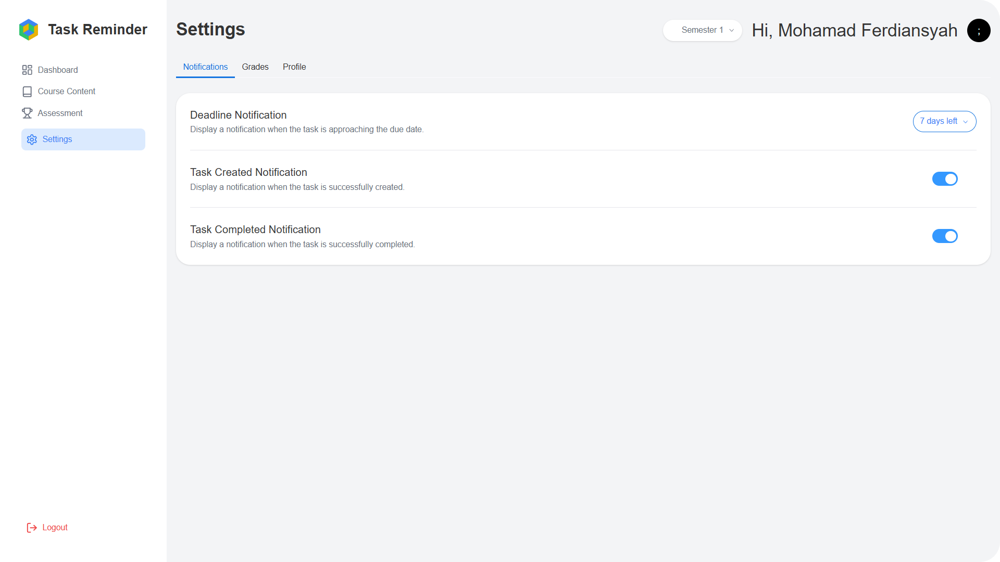

  

# Task Reminder

Task Reminder is a college assignment reminder application designed to help students manage and prioritize their tasks. This app offers automatic reminders, task scheduling, and a user-friendly interface to ensure all assignments are completed on time.

## Features

- **Automatic Reminders**: Sends notifications for upcoming deadlines, ensuring no task is missed.
- **Task Scheduling**: Allows users to add assignments with due dates and customizable reminders.
- **User-Friendly Interface**: Designed with a simple and intuitive layout for a comfortable and efficient user experience.
- **Task Prioritization**: Enables users to set importance levels for tasks, helping them focus on the most urgent work.
- **Charts**: Displays graphs of task distribution based on semesters and statuses, helping users understand overall workload distribution.
- **Grading System**: Allows students to record grades for each course, with an automatic system that calculates GPA based on the entered data.

## Screenshots

Here are the interface screenshots of Task Reminder:

### Dashboard

### Bar Chart

### Course Contents

### Assessments

### Settings

### Grades
