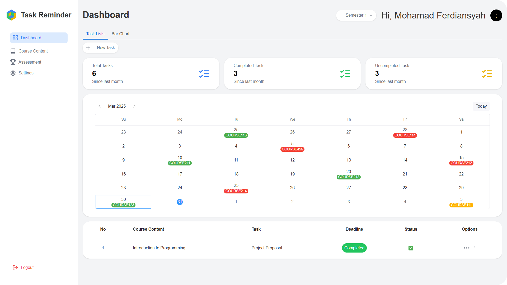
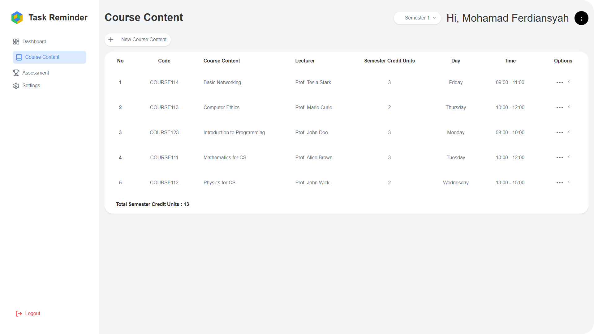
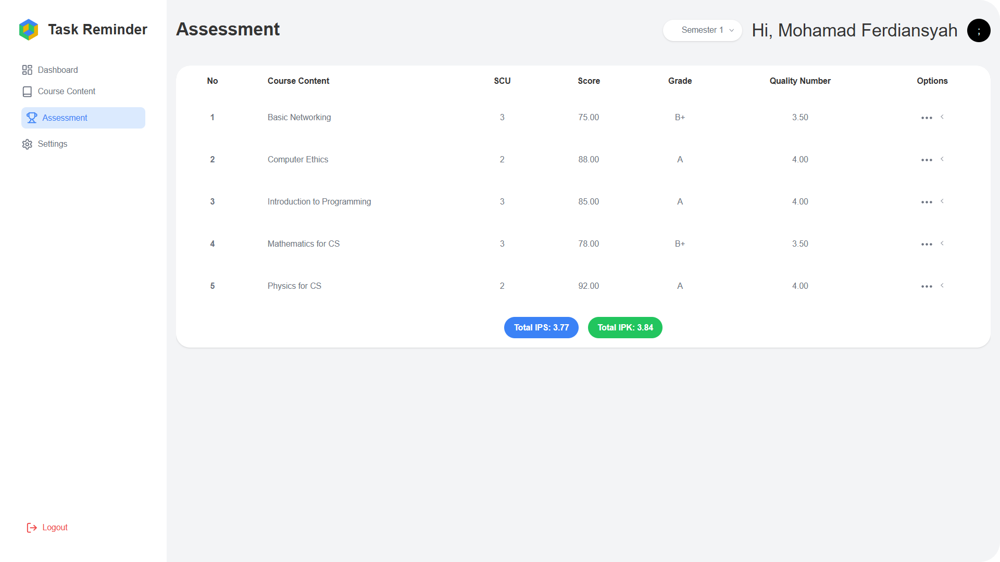
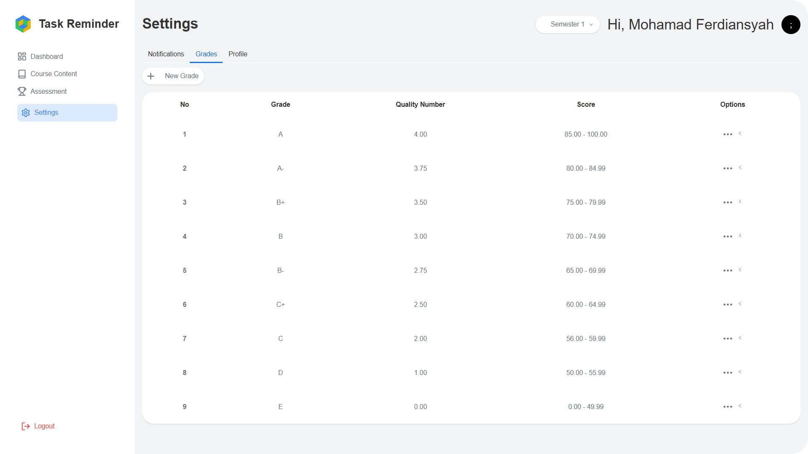

  

# Task Reminder

Task Reminder adalah aplikasi pengingat tugas kuliah yang dirancang untuk membantu mahasiswa mengelola dan memprioritaskan tugas mereka. Aplikasi ini menawarkan fitur pengingat otomatis, penjadwalan tugas, dan antarmuka yang ramah pengguna untuk memastikan semua pekerjaan selesai tepat waktu.

## Fitur

- **Pengingat Otomatis**: Mengirim notifikasi kepada pengguna untuk tugas yang mendekati tenggat waktu, memastikan tidak ada tugas yang terlewat.
- **Penjadwalan Tugas**: Memungkinkan pengguna menambahkan tugas dengan tanggal jatuh tempo serta pengingat yang dapat disesuaikan sesuai kebutuhan.
- **Antarmuka Pengguna yang Ramah**: Dirancang dengan tampilan sederhana dan intuitif untuk memberikan pengalaman pengguna yang nyaman dan efisien.
- **Prioritas Tugas**: Memungkinkan pengguna menetapkan tingkat kepentingan pada setiap tugas untuk membantu fokus pada pekerjaan yang lebih mendesak.
- **Chart**: Menampilkan grafik jumlah tugas berdasarkan semester dan status, membantu pengguna memahami distribusi tugas secara keseluruhan.
- **Penilaian**: Memungkinkan mahasiswa mencatat nilai untuk setiap mata kuliah, dengan sistem yang otomatis menghitung IPS dan IPK berdasarkan data yang dimasukkan.

## Screenshot

Berikut adalah tampilan antarmuka aplikasi Task Reminder:

### Dashboard

### Bar Chart

### Course Contents

### Assessments

### Settings

### Grades

